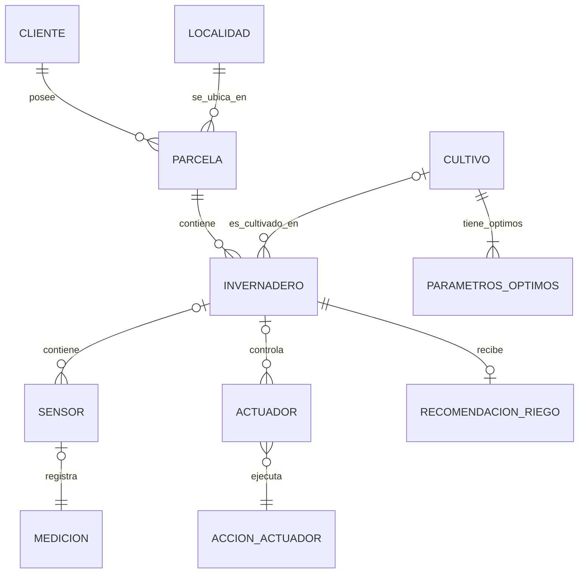

# Proyecto SIRA 🌱💧

> **Sistema Integral de Riego Automático**  
> 🎓 **Proyecto Fin de Grado — ASIR**  
> Una plataforma inteligente y segura para la gestión de explotaciones agrícolas bajo invernadero, diseñada para la eficiencia hídrica y la automatización climática.

<p align="center">
  
  
  
  
</p>

---

## 🌟 Características Principales

| 🚀 **Rendimiento** | 🛡️ **Seguridad** | 🎨 **Interfaz** | 📊 **Monitorización** |
| :--- | :--- | :--- | :--- |
| **Backend Asíncrono** con FastAPI y Python 3.11+. | **Protocolo Iron Fortress**: JWT, Bcrypt y rotación de sesiones. | **Zero-JS Policy**: UI 100% PHP/CSS de alta fidelidad. | **Simulación IoT**: Inyección de telemetría climática realista. |
| **SSR (Server-Side Rendering)** para máxima compatibilidad. | **Aislamiento Docker**: Redes privadas y volúmenes persistentes. | **Glassmorphism**: Estética premium con filtros dinámicos. | **Lógica Agronómica**: Automatización según tipo de cultivo. |

---

## 🏗️ Stack Tecnológico

- **Frontend:** PHP 8.2 (Lógica de presentación) + CSS 3 Moderno (Variables, Grid, Flexbox).
- **Backend:** FastAPI (Python) - API REST de alto rendimiento.
- **Persistencia:** PostgreSQL 15+ con persistencia en volumen Docker.
- **Infraestructura:** Nginx (Proxy Inverso / Gateway), Docker, Docker Compose.
- **Cloud:** Despliegue optimizado para AWS (EC2).

---

## 📦 Estructura del Ecosistema

```text
Proyecto_SIRA/
├── backend/            # API REST (Python/FastAPI) + Lógica de Automatización
├── frontend/           # Dashboard UI (PHP 8.2) + Estilos CSS Dinámicos
├── nginx/              # Gateway y Perímetro de Seguridad (Proxy Inverso)
├── docs/               # Documentación Técnica Maestras (PDF/MD/Mermaid)
├── scripts/            # Simulador IoT y herramientas de Backup
├── data/               # [VOLUMEN] Almacenamiento seguro de BBDD
└── docker-compose.yml  # Orquestación de toda la infraestructura
```

---

## 🛡️ Protocolo de Seguridad: "Iron Fortress"

SIRA no solo gestiona riego, protege datos críticos de la explotación:
- **JWT Stateless**: Autenticación mediante tokens firmados, nunca almacenados en texto plano.
- **Session ID Único**: Prevención de sesiones concurrentes y secuestro de sesiones.
- **Búnker de Persistencia**: Historial de seguridad aislado físicamente del código.
- **Zero-Trust Interno**: Comunicación PHP-to-API validada en cada petición.

📄 *Más información en el [Manifiesto de Seguridad](docs/infraestructura/manifiesto_seguridad.md).*

---

## 🚀 Despliegue Rápido (Docker Compose)

### 1. Clonar y Configurar
```bash
git clone https://github.com/JuanRisueno/Proyecto_SIRA.git
cd Proyecto_SIRA
cp .env.example .env
```

### 2. Lanzar Infraestructura
```bash
docker compose up -d --build
```

### 3. Acceder
- **Plataforma:** [http://localhost:8085](http://localhost:8085)
- **API Docs (Swagger):** [http://localhost:8085/api/docs](http://localhost:8085/api/docs)
- **ReDoc (Documentación limpia):** [http://localhost:8085/api/redoc](http://localhost:8085/api/redoc)

---

## 🏛️ Arquitectura de Comunicación

El sistema opera mediante una **Separación Estricta de Responsabilidades**:
1. **Nginx** recibe la petición y decide: si es `/api/` va al Backend, si es `/` va al Frontend.
2. **Frontend (PHP)** realiza peticiones internas cURL a la API usando el token JWT del usuario.
3. **Backend (FastAPI)** valida la sesión, consulta **PostgreSQL** y devuelve JSON.
4. **PHP** renderiza el HTML final y lo entrega al navegador.

---

## 🛠️ Comandos de Utilidad

Para la gestión diaria de la infraestructura con Docker Compose:

- **Levantar en segundo plano:** `docker compose up -d`
- **Ver logs en tiempo real:** `docker compose logs -f`
- **Reiniciar un servicio específico:** `docker compose restart api`
- **Acceso a la base de datos:** `docker compose exec db psql -U sira_user -d sira_db`
- **Limpieza total:** `docker compose down -v`

---

## 🧪 Desarrollo Local (Sin Docker)

Si prefieres ejecutar el backend de forma nativa para depuración:

```bash
cd backend
python3 -m venv .venv
source .venv/bin/activate
pip install -r requirements.txt
uvicorn app.main:app --reload --port 8000
```
*La API estará disponible en `http://localhost:8000`.*

---

## 🩺 Verificación y Pruebas Rápidas

Puedes verificar el estado de los servicios mediante `curl`:

```bash
# Verificar Salud del API
curl -s http://localhost:8085/api/

# Verificar Documentación
curl -I http://localhost:8085/api/docs
```

---

## 📊 Modelado de Datos (E/R)



---

## 📂 Documentación de Referencia

- [📔 Dossier Integral del Proyecto](docs/dossier_integral/SIRA_DOSSIER_INTEGRAL.md)
- [🛡️ Manifiesto de Seguridad "Iron Fortress"](docs/infraestructura/manifiesto_seguridad.md)
- [🏗️ Arquitectura de Sistemas](docs/infraestructura/arquitectura_sira.md)
- [🧪 Simulador y Lógica IoT](docs/planificacion/simulacion_iot.md)

---

## 📬 Autores y Equipo

- **Juan Risueño** - *Backend Lead / DevOps (FastAPI, Protocolo Iron Fortress, AWS, Docker/Nginx)*
- **Jorge Pedro López** - *Coordinador / Frontend (Arquitectura PHP, SQL, Simulación IoT, UI)*
- **Alfonso Navarro** - *Modelado de Datos y Documentación Técnica del TFG (Arquitectura CSS)*

---

## 📄 Licencia
Este proyecto es un **Trabajo de Fin de Grado (TFG)**. Licencia MIT.  
Copyright (c) 2026 Juan Risueno.
